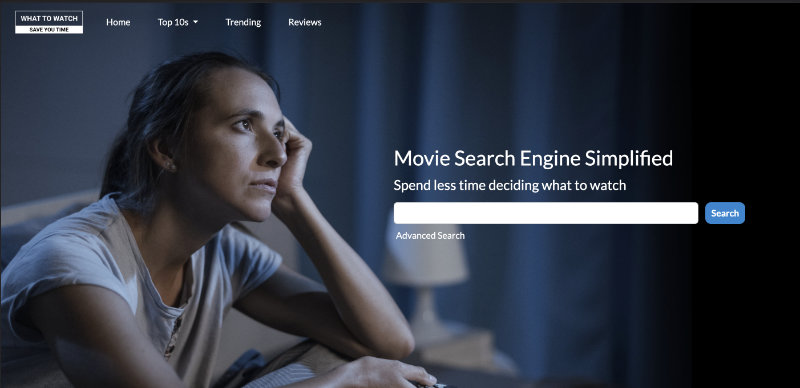
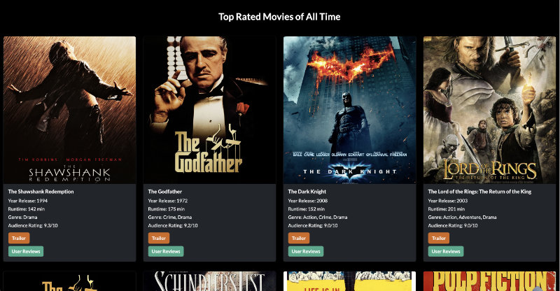

# whattowatch.fun - Movie Search Engine Simplified
If you've frequently spent more time that you're supposed to (e.g. half an hour or more) browsing through movie selections on NetFlix, Binge, or any other video streaming services, and still can't decide what exactly you want to watch, you're not alone. While existing movie search websites, such as imdb.com also provides advanced search functionality, their extensive search filter options can be quite overwhelming and time-consuming as users have to decide what search parameters actually matter to them. whattowatch.fun aims to provide a more simplified movie search solution that limit the number of search parameters to the ones that matter the most to general audience, including movie plot, genre, runtime, year release, and user votes. Presets of filter search, such as Top 10s and Trending movies are also provided for even quicker search.

--------------------------------------------------------

## Table of Contents
- URLs
- User Story
- Technologies
- APIs
- Webpages, Key Features, Usage, and Limitations
- Directions for Future Development
- Credits

--------------------------------------------------------

## URLs
- [Deployed Application URL](https://e73707.github.io/Movie-search-engine/)
- [GitHub Repository URL](https://github.com/E73707/Movie-search-engine)

--------------------------------------------------------

## Technologies
whattowatch.fun is created with the following web technologies:
- HTML
- CSS
- Bootstrap
- JavaScript
- jQuery
- Day.js
- localStorage client-side storage

--------------------------------------------------------

## APIs
- imdb-api.com
- api.themoviedb.org
- youtube.googleapis.com

--------------------------------------------------------

## Webpages, Key Features, Usage, and Limitations

### **1. Homepage (index.html)**
The homepage is divided mainly into 3 sections:
- Navigation Bar, which is also used in every other page
- Search Bar / Search Container
- Initial Rendering / Search Results Container

Only IMDB API is used to fetch data on the homepage.

Homepage is 100% responsive.

#### **i. Navigation Bar**
The navigation bar consists of the following elements:

- Logo image -- the image is linked to index.html

- "Home" menu -- this text menu is also linked to index.html (Note: it might not be 100% intuitive to every user that clicking the logo image is also linked to index.html, hence the text link is also included)

- "Top 10s" menu -- this dropdown menu is linked to Top-10.html page where users can search for Top 10 Movies according to their genre preference

- "Trending" menu -- this text menu is linked to trending.html page where users can search for trending movies according to...

- "Reviews" menu -- this text menu is linked to reviews.html page where users can search for movie reviews of their movie of choice

#### **ii. Search Bar for Simple Search**

    

In simple search (i.e., when the 'Advanced Search' filters are still hidden), any keyword(s) that a user enters into a search query field (followed by clicking on the search button) would be used to search for the same word in movie plots and return only the movies with keyword match. 

The simple search functionality employs a logical disjunction (i.e., equivalent to using the OR operator). In other words, all the search keywords will be used to search for movies of which the plots contain one or more search keywords.

***Note:*** As IMDB AdvancedSearch API doesn't seem to fetch accurate data when it comes to keyword search, the following step-by-step workaround is deployed instead.

**Step 1: Reformat the search query** - Taking into account of the possibility of extra space, comma, and period anywhere within a search query string, it is necessary to reformat the string with replace(), trim(), and split() as shown on Line 53 in script.js file. The original search query string would then be converted to a new array of strings.

**Step 2: Push only a non-empty string into normalSearchQuery array, which is then sent to searchMoviePlot function** - Only non-empty strings are useful in keyword search, and this is achieved by the use of conditional statement on Line 61-62 in script.js file.

**Step 3: Fetch API data and finish the search** 

The API data used in simple search functionlity have the following preset parameters: only newest english-language feature films with user rating between 7 to 10 and minimum user votes of 50,000. Not knowing for certain how big the fetched data would be, the fetched data is limited to only 250 objects. The data is sorted by user ratings in a descending order.

In this app version, this API data for simple search is automatically fetched once a day and stored in client-side localStorage. The simple search would attempt to find the keyword(s) in the movie plot of these 250 movie objects, and nothing more. 

**Limitations:** 
In reality, the simple search shouldn't be limited to just 250 data objects, as this could significantly limit the amount the search results. With more time and better documentation, manipulating the IMDB AdvancedSearch API could have been performed more efficiently. Nevertheless, there's a merit to saving these objects to localStorage. By doing so, it siginificantly minimizes the amount of API calls (Note: IMDB caps maximum API calls to just 100 calls a day). This is deemed an interesting use of localStorage, hence the codes stay for the time being.

#### **iii. Advanced Search**

    

When 'Advanced Search' text link is clicked, the following filter options would be displayed

- Genre -- this filter employs logical disjunction; search results would include movies that falls into one or more user-selected genres

- Duration (a.k.a. runtime) -- users sometime know that they don't want to spend more than certain amount of hours watching a movie, and they can search for the movies with their preferred runtime with this filter. Available movie runtime ranges from 60 minutes to 300 minutes. Although there are some movies with a duration of 8 hours or so, the 60-300 minutes range should  cover majority of mainstream feature films already. Anything outside this range is likely to return no search results especially when other search parameters are used as well, the scenario which would uncessarilty waste API calls. The default duration is set at 90-180 minutes.

- User Ratings -- Users can search for feature films with user ratings between 1-10. Movies with no rating would not be returned in the search results. The default user ratings is set at 7-10.

- Year Release -- Users can search for feature films with release year between 1940 to the present year. The present year is automatically adjusted with Day.js (i.e., line 412 in script.js). The default year release is set between 2012-present.

- User Votes -- Users can also refine their movie search further with the amount of user votes; the higher the amount, the more reliable the user rating is. Unlike in simple search, no default value for minimum and maximum user votes are set.

**NOTE:** While genre, user ratings, year release, and user votes are variable parameters inside the API URL, movie runtime (a.k.a. Duration) parameter is applied after the data is fetched. In fact, this is one of IMDB parameters that do not work perfectly. When including runtime parameter inside the API URL, the amount of filtered fetched data appear to be significantly lower than that found in the fetched data to which the parameter is applied afterwards (e.g. null vs 119 search results for English-language feature film in comedy and/or romance genre with minimum user rating of 7 and has a runtime between 90-180 minutes). But this could also be an issue with the &languages=en IMDB API URL parameter that fails to work correctly as well, as the search results on this web application also returns movies in languages other than English. Keyword search inside movie plots would also be run as soon as the runtime filtering is completed.

**Limitations:**
Similar to the simple search, fetched data is limited to 250 data objects. As runtime and keyword searches are performed after the data is fetched (instead of right from the start), the number of search results is lower than otherwise. As previously mentioned, this workaround is necessary due to IMDB API AdvancedSearch URL not working accurately when handling certain parameters. 

#### **iv. Initial Rendering / Search Results Container**

    

When a user visits the website for the first time or when the web application is refreshed, the search results section, which is right after the background image, would automatically display pre-fetched data which has the following preset parameters: latest english-language feature films with user rating between 7 to 10 and minimum user votes of 50,000. The The initial heading in this section is "Top Rated Movies of All Time" as the movie list is sorted by user rating in descending order. This heading will change to "Search Results" when users use either simple search or advanced search.

The search reseults rendering would display the following details:
- Movie Title
- Year Release
- Genre(s)
- Audience Rating (a.k.a. user rating)
- Trailer button -- when a user clicks on this button, a YouTube trailer video modal would pop up. 
- Reviews button -- when a user clicks on this button, the user will be redirected to 'Reviews' page and the reviews data for that particular movie will be automatically fetched for them.

    

--------------------------------------------------------
### **2. Top-10s (Top-10.html)**

The Top 10 window is resposnible for allowing the user to discover the top 10 movies by genre with a range of 19 genres to select from. 

The Top 10 section consists of 3 main features, similar to the home page:
- navbar
- user input (genre and user votes)
- card display 

The page uses both TMDB api as well as google developer Youtube api

#### i  Navbar:

The navbar is kept the same as the home page, however the Top 10s option contains a dropdown which allows for a quick search of three movie genres that we thought were likely to be the most popular. When clicking on one of these options, the user will be redirected to the top 10 page, and the site will automatically detect if one of the dropdowns are selctected and will render the results on loading the page. Otherwise, if the default dropdown value of Top 10s is selected, the top 10 of all genres will load. 

#### ii User inputs:

The User inputs provide the user with two simple search filter options. genre and minimum vote count.

- On page load, the script will fetch the list of genres and dynamically create buttons and append the associated value with that button. 

once the user is finished inputting the values they can choose to click the find movies button, which will use the TMDB api to fetch for the the top ten movies that fit into the filtered values and will create card elements of those movies fetched.

#### iii Card Display:

The cards created contain teh following features

- Movie title
- Movie rating 
- A short description
- A reviews button 
- A trailer Button 

**Reviews button:** 
- use the title appended to the card to redirect to the reviews page, where a review of the chosen movie will appear.

**Trailer button:**
- uses the title appended to the card with a keword 'trailer' added to it to search the youtube database for the most relevant video and executes a function with the video id on a separate API which will generate an iframe and modal for the youtube video to play.  

#### vi Limitations

The TMDB database can occasionally have high rated movies with very low vote counts, meaning that some fetched information will be unreliable, to get around this the minimum vote count is implemented.

The YouTube api can occasionally fetch an irrelevant movie if the TMDB title is different, this only happens in rare cases.

--------------------------------------------------------
### **3. Trending (trending.html)**
The Trending page allows the user to discover the Trending movies of the Week and Day. 
This page consists of 3 main features, similar to the home page:
- navbar
- dropdown selection
- card display 
The page uses The Movies Database-TMDB- api

#### i  Navbar:
The navbar is kept the same as the home page, however the Top 10s option contains a dropdown which allows for a quick search of three movie genres that we thought were likely to be the most popular. When clicking on one of these options, the user will be redirected to the top 10 page, and the site will automatically detect if one of the dropdowns are selctected and will render the results on loading the page. Otherwise, if the default dropdown value of Top 10s is selected, the top 10 of all genres will load. 

    

#### ii dropdown selection:

-The dropdown provides the user with two search filter options: Day and Week.

-If user click the search button without selecting one of the day/week options, a notification will pop up and disappear after few seconds. 

-once the button is clicked,it will use the TMDB api to fetch for the the top 20 popular movies of the day or week based on user selection.

    

#### iii Card Display:

The cards created contain teh following features

- Movie image
- short description of the movie

    

--------------------------------------------------------
### **4. Reviews (reviews.html)**
The reviews page has two ways of using: users can search for the reviews of a certain movie directly by using the search bar, or if they are checking movies from the home page or top-10 page, they can click the review button and it will redirect to this review page and show the reviews. 

#### **i. Search Bar**
The search bar is designed by using jquery autocomplete function assigned to the keyup event, so that when the user enter some keywords, such as "the godfather", all the movies which contain the keywords will be shown in the list while typing ignoring case, users can simply click whichever the one they are looking for, instead of typing the full name of the movie. All the movie names in the list are fetched from the TMDB api, which keep updating when the input by the user changes. 

    

#### **ii. Search results**
By using the search bar, or click the review button from other page, the search result part will show the movie's information and reviews fetched from The Movie Database (TMDB). 

The movie's information card contains a poster, the movie's name, release date, duration, rating, a short description and the starrings. The reviews cards contain the poster's username, the post date, and the review contents.

    

--------------------------------------------------------

## **Directions for Future Development**
- UX/UI – pagination on search results
- Additional search filter options
- Identification of online video streaming service providers that has API available (Note: NetFlix or Binge do not provide APIs)
- User-generated reviews either to wheretowatch.fun or the API websites made possible
- Proper consumer/user research to make sure that the UX/UI and functionality really satisfy their needs

--------------------------------------------------------

## **Credits (Alphabetical Order):**
- Eddie Vaughan
- Majid Pourkazemi
- Piyawit Teeraprasert
- Siyu Liu
